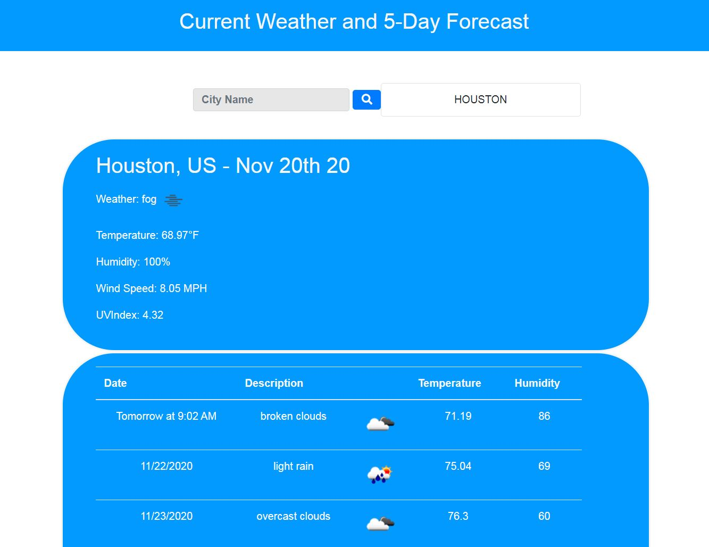

# Weather-App

## Description

The Weather App is a simple app that allows you to search for a city's current weather and 5 day forecast.  name.       

## Technologies
The Weather App was created by utilizing HTML, CSS and JavaScript.  OpenWeather API calls for the forecast are made with AJAX and moment.js to set the date and time.  

## Usage

Simply input the city you would like to gather forecast data from and hit the search button.  The page will populate with your request.   

## Weather-App GitHub Link
https://github.com/guillenjoshua/07-WeatherApp

## Author
Joshua Guillen

### GitHub Profile: 
https://github.com/guillenjoshua

### Email Contact: 
guillenjoshua@gmail.com

## IMG
